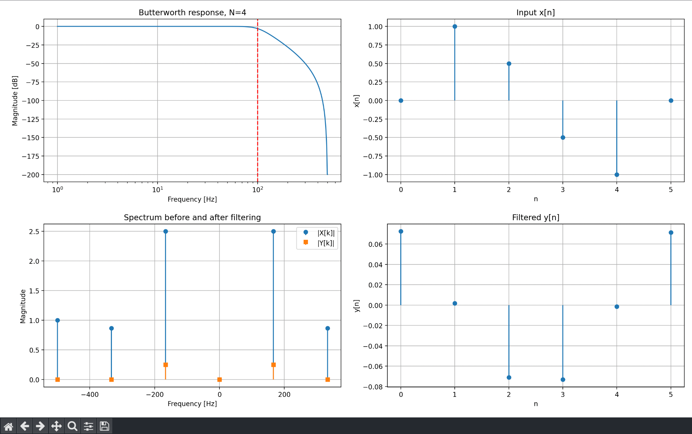

# Nth-Order Butterworth Filter in Python

Python implementation of an Nth-order Butterworth low-pass filter using the bilinear transform and frequency-domain filtering.



## Overview

This project was developed as part of a Digital Signal Processing course.

The program accepts:

- Filter order `N`
- Input discrete-time signal `x[n]`

It then designs a digital Butterworth low-pass filter and applies it entirely in the frequency domain.

The implementation follows this workflow:

1. Pre-warp the cutoff frequency.
2. Calculate the analog Butterworth poles.
3. Apply the bilinear transform.
4. Evaluate the digital filter response at the DFT frequency bins.
5. Compute the FFT of the input signal.
6. Apply the filter using `Y[k] = H[k] X[k]`.
7. Reconstruct the filtered signal using the IFFT.

## Main Features

- User-defined Butterworth filter order
- User-defined input signal
- Analog Butterworth prototype generation
- Cutoff-frequency pre-warping
- Bilinear transform
- Digital frequency-response calculation
- FFT-based frequency-domain filtering
- IFFT reconstruction of the output signal
- Visualization of:
  - Butterworth magnitude response
  - Input signal `x[n]`
  - Input and output spectra
  - Filtered output signal `y[n]`

## Technologies

- Python
- NumPy
- Matplotlib

## Filter Parameters

The current implementation uses:

- Sampling frequency: `1000 Hz`
- Cutoff frequency: `100 Hz`

The filter order `N` and the input signal `x[n]` are entered by the user.

## How It Works

### 1. Pre-warping

Because the bilinear transform causes frequency warping, the analog cutoff frequency is pre-warped before designing the analog Butterworth prototype.

### 2. Analog Butterworth Poles

The program calculates the `N` poles of the analog Butterworth filter in the left half of the complex plane.

### 3. Bilinear Transform

The analog filter is mapped to the digital domain using:

`s = 2fs(1 - z⁻¹) / (1 + z⁻¹)`

The digital response is evaluated directly at the DFT frequency bins.

### 4. Frequency-Domain Filtering

The input signal is transformed using the FFT:

`X[k] = FFT{x[n]}`

The output spectrum is then calculated using:

`Y[k] = H[k] X[k]`

Finally, the filtered signal is reconstructed using:

`y[n] = IFFT{Y[k]}`

## How to Run

1. Make sure Python 3 is installed.

2. Install the required packages:

```bash
pip install numpy matplotlib
```

3. Run the program:

```bash
python butterworth_filter.py
```

4. Enter the filter order when requested.

Example:
```bash
Enter N: 4
```

5. Enter the input signal as comma-separated values.

Example:
```bash
Enter x[n]: 0, 1, 0.5, -0.5, -1, 0
```

## Output

The program generates four plots:

Butterworth magnitude response in dB
Input signal in the time domain
Input and output spectra
Filtered output signal in the time domain
Important Note

This project is an educational DSP implementation intended to demonstrate the relationship between analog Butterworth filter design, the bilinear transform, FFT-based filtering, and digital signal processing.

The multiplication of two finite-length DFTs corresponds to circular convolution, so wrap-around effects may appear depending on the signal length.

## Contributors

This project was developed as a team academic project with:

- [Omar Darwish](https://github.com/omarda44)
- [Abd Almoaz Awadallah](https://github.com/Abd-Aw)
- [Khader Sandouka](https://github.com/Khader127)

## Academic Context

Developed as part of a Digital Signal Processing course project.
